# Shake&Tune baseline tuning — 2026-04-10

First end-to-end Shake&Tune calibration on the printer after installing the plugin. Establishes a mechanical baseline, applies new input shaper values, and **then cross-validates against the EBB36 onboard LIS2DW accelerometer** — which proves that the apparent "bimodal Y" seen by the Beacon was almost entirely a Beacon-mount-flex artifact, not a real gantry resonance. See [§4 LIS2DW cross-validation](#4-lis2dw-cross-validation--the-bimodal-y-was-mostly-a-beacon-mount-artifact).

## Session conditions

| | |
|---|---|
| Date | 2026-04-10 (15:00 - 17:30 BST) |
| Klipper | `v0.13.0-540-g57c2e0c96-dirty` |
| Shake&Tune | `v6.0.0` |
| Beacon firmware | `v2.0.0-31-g4d2b15c` (dev channel) |
| Active accel chip | Beacon RevH (only chip enabled at the time) |
| Mounting base during runs | Filing cabinet (run 1, run 3) and bare floor (run 2) |
| Initial state | Cold (~27 °C all sensors), bed clear, unhomed |
| `max_accel` during tests | Klipper 10 000 mm/s², Shake&Tune internal sweeps at 400-1500 mm/s² |

## Config changes applied to `printer.cfg` during this session

| Section | Change | Status at end of session |
|---|---|---|
| `[beacon]` | Added `accel_axes_map: -x, -y, z` (per `AXES_MAP_CALIBRATION` 100 % confidence) | **Kept** |
| `#*# [input_shaper]` (SAVE_CONFIG block) | Updated frequencies, type, and damping ratios — see [Final saved values](#final-saved-input-shaper-values) | **Kept** |
| `[output_pin relay]` | Added `shutdown_value: 1` to allow `FIRMWARE_RESTART` instead of Pi reboot after a relay trip | **Reverted** for safety — relay still cuts AC mains on any Klipper shutdown, as it should |

Backups of every pre-edit `printer.cfg` are at `~/printer_data/config/printer.cfg.bak-*` on the printer:

- `printer.cfg.bak-pre-shutdown-value`
- `printer.cfg.bak-pre-axes-map`
- `printer.cfg.bak-pre-shaper-update`
- `printer.cfg.bak-pre-shutdown-revert`

---

## 1. Axes map calibration

`AXES_MAP_CALIBRATION` runs the toolhead through a controlled motion pattern on each axis and reads the accelerometer to determine the orientation of the sensor relative to printer coordinates. Run once at session start, after a Klipper RESTART (third attempt — first two crashed the Beacon, see [Beacon USB cliff](#beacon-usb-cliff-during-motion)).

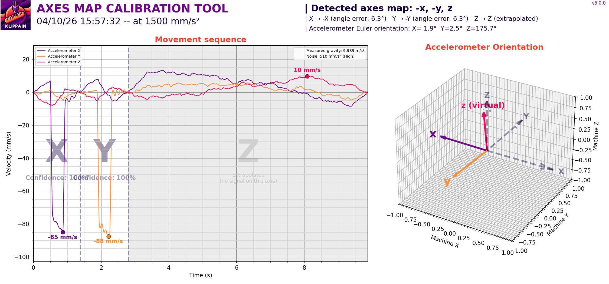

| Result | Value |
|---|---|
| **Detected axes map** | **`-x, -y, z`** |
| X angle error | 6.3° |
| Y angle error | 6.3° |
| Confidence X | **100 %** |
| Confidence Y | **100 %** |
| Measured gravity | **9.999 m/s²** (textbook 1 g) |
| Euler orientation | X=-1.9°, Y=2.5°, Z=175.7° |
| Test acceleration | 1500 mm/s² |

**Interpretation:** the Beacon's onboard accelerometer is rotated 180° around the vertical axis relative to the printer frame (no axis swap, just sign-flipped X and Y). Z is unflipped, confirming the coil is right-side-down. Configured via `accel_axes_map: -x, -y, z` in the `[beacon]` section.

> ⚠️ **Gotcha discovered**: the Beacon plugin uses the option name `accel_axes_map`, not the standard Klipper `axes_map`. Setting `axes_map` directly causes Klipper to halt with `Option 'axes_map' is not valid in section 'beacon'`. The Beacon namespaces accelerometer-mode options with an `accel_` prefix to disambiguate from probe options.

---

## 2. Belt symmetry

`COMPARE_BELTS_RESPONSES` drives each CoreXY belt independently and overlays their frequency responses to expose tension or wear asymmetries.

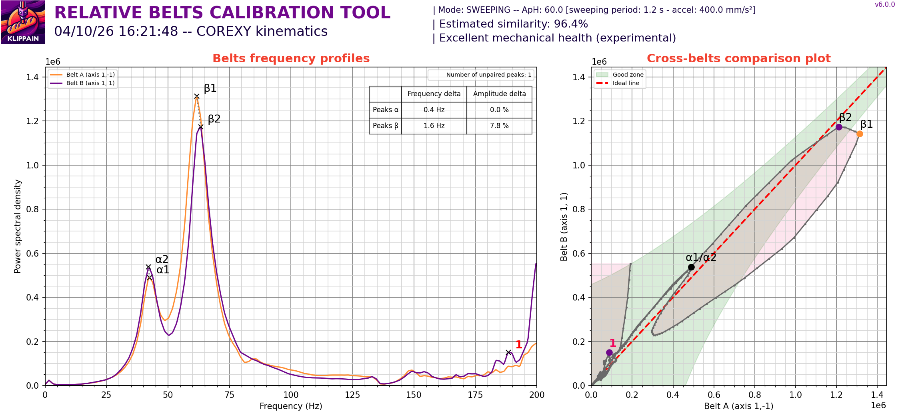

| Metric | Value | Threshold for "good" | Verdict |
|---|---|---|---|
| **Estimated similarity** | **96.4 %** | > 90 % is "excellent" | ✅ Excellent |
| α-peak frequency delta | 0.4 Hz | < 1.5 Hz | ✅ |
| α-peak amplitude delta | 0.0 % | < 25 % | ✅ |
| β-peak frequency delta | 1.6 Hz | < 5 Hz | ✅ |
| β-peak amplitude delta | 7.8 % | < 25 % | ✅ |
| Cross-belts plot trace | Inside green good zone end-to-end | — | ✅ |

**Interpretation:** belts are tensioned to nearly identical frequencies. **No retensioning required.** The α-peak (≈ 43 Hz) and β-peak (≈ 64 Hz) line up almost exactly with the previously-saved input shaper frequencies (Y=43.4 Hz, X=63.8 Hz), confirming the basic mechanical state hasn't drifted since the last tune.

---

## 3. Input shaper calibration — three independent runs

`AXES_SHAPER_CALIBRATION` was run **three times** to test reproducibility and to deliberately measure the effect of the printer's mounting base on the result. The conditions:

| Run | Time (BST) | Mounting base | Purpose |
|---|---|---|---|
| 1 | 16:37:34 | Filing cabinet (original) | Baseline measurement |
| 2 | 16:56:55 | Bare floor (after physical relocation) | Test cabinet contribution |
| 3 | 17:10:55 | Filing cabinet (after move-back) | Reproducibility check on cabinet |

### X axis — three runs

| | Run 1 (cabinet) | Run 2 (floor) | Run 3 (cabinet, final) |
|---|---|---|---|
| Best shaper | MZV @ 60.6 Hz | MZV @ 61.2 Hz | **MZV @ 61.0 Hz** |
| Damping ratio (ζ) | 0.061 | 0.060 | **0.059** |
| MZV residual vibration | 0.6 % | 0.5 % | 0.7 % |
| MZV max accel | 10 740 | 10 960 | **10 880** |

X is unanimously **MZV ~ 61 Hz, ζ ~ 0.060** across all three runs and both bases. **The X axis is unaffected by the mounting base** because only the toolhead translates during X moves — reaction force on the base is small. This uniformity is the strongest sanity check that the methodology and the new `accel_axes_map` are producing consistent measurements.

| Run | Image |
|---|---|
| 1 (cabinet) | 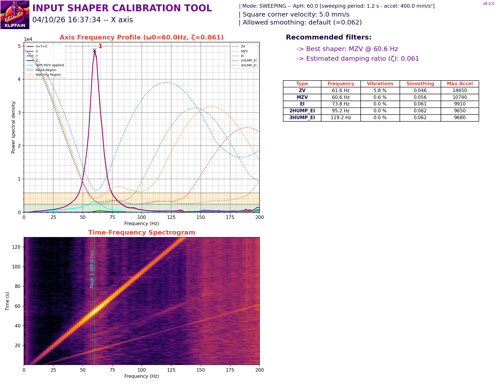 |
| 2 (floor) |  |
| 3 (cabinet, final) | 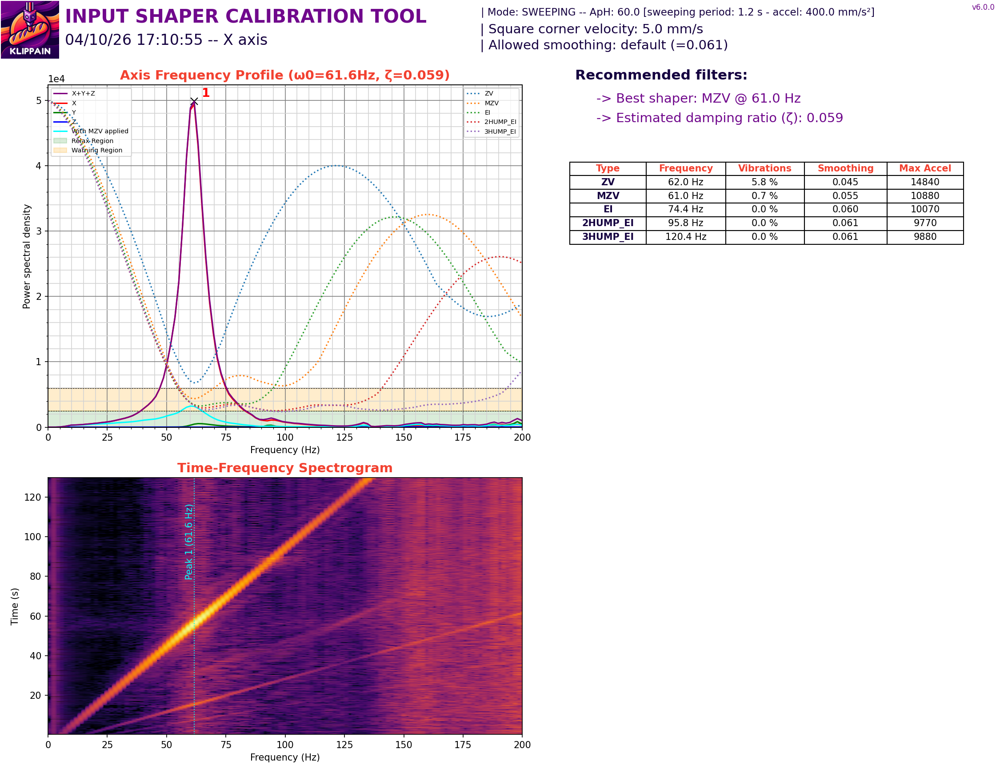 |

### Y axis — three runs

| | Run 1 (cabinet) | Run 2 (floor) | Run 3 (cabinet, final) |
|---|---|---|---|
| **Peak 1 frequency** | 41.2 Hz | 43.6 Hz | **~43.0 Hz** |
| **Peak 2 frequency** | 65.1 Hz | 66.5 Hz | **~65 Hz** |
| Damping ratio (ζ) | 0.028 | **0.007** | 0.018 |
| MZV @ Peak 1 vibration | 1.8 % | 8.7 % | 2.9 % |
| Recommended shaper (performance) | EI @ 52.8 Hz | (3HUMP_EI) | **EI @ 54.4 Hz** |
| Recommended shaper (low vibration) | 3HUMP_EI @ 79.2 Hz | 3HUMP_EI @ 70.8 Hz | 3HUMP_EI @ 77.0 Hz |

The Y axis shows **two consistent resonance peaks across all three runs**. The peak *frequencies* don't shift with the mounting base — only the *damping* changes:

- **Cabinet** ζ ~ 0.018-0.028 — the cabinet contributes meaningful damping through its own internal friction (joints, drawer slides)
- **Floor** ζ = 0.007 — bare-floor measurement reveals the printer's true intrinsic damping, which is very low for a heavy CoreXY toolhead on linear-rail kinematics

The fact that the peak frequencies didn't merge when the cabinet was removed **rules out cabinet-induced mode coupling**. The two peaks are intrinsic to the printer (or to the sensor mounting — see [Unresolved](#unresolved-bimodal-y-resonance) below).

| Run | Image |
|---|---|
| 1 (cabinet) | 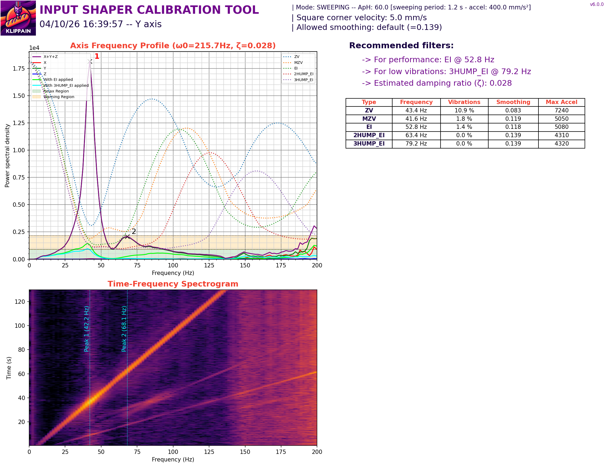 |
| 2 (floor) | 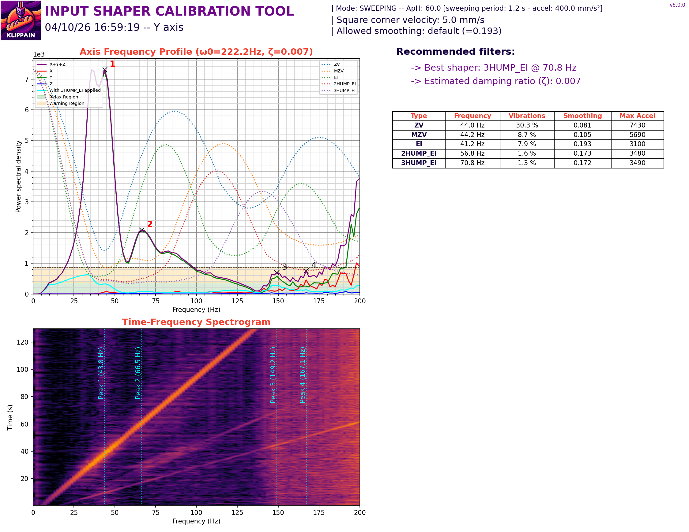 |
| 3 (cabinet, final) |  |

---

## Final saved input shaper values

After three runs of cross-checking, the values applied via direct edit of the `#*# [input_shaper]` SAVE_CONFIG block at the bottom of `printer.cfg`:

| Axis | Type | Frequency | Damping ratio | Previous saved |
|---|---|---|---|---|
| **X** | MZV | **61.0 Hz** | **0.059** | MZV @ 63.8 Hz, ζ default 0.1 |
| **Y** | **EI** | **54.4 Hz** | **0.018** | MZV @ 43.4 Hz, ζ default 0.1 |

**Why EI on Y instead of MZV?** Critical observation from the run-3 filter table:

| Y filter | Vibrations | Smoothing | Max accel |
|---|---|---|---|
| MZV @ 43.0 | 2.9 % | 0.111 | 5390 |
| **EI @ 54.4** | **0.0 %** | **0.111** | **5400** |

EI has **identical smoothing and identical max accel to MZV** but suppresses *both* Y peaks instead of just one. There is literally no downside to EI here in this measurement — it's a strict improvement.

`max_accel` was left at its existing value of **10 000 mm/s²**, above the EI shaper's recommended ceiling of 5 400 mm/s². To be revisited later with print-quality observations.

> ⚠️ **Gotcha discovered**: `SET_INPUT_SHAPER` does not trigger Klipper's `save_config_pending` flag — only the built-in `SHAPER_CALIBRATE` macro does. To persist values from external tuning (Shake&Tune, manual measurement), edit the `#*# [input_shaper]` block at the bottom of `printer.cfg` directly, then `RESTART` Klipper.

---

## Unresolved (at the time of §3): bimodal Y resonance

> ⚠️ **This was resolved in §4 below — the second Y peak turned out to be the Beacon mount flexing on the cooling horns, not a real gantry resonance.** The narrative below records the state of understanding at the end of §3 (before the LIS2DW cross-validation), preserved as the historical decision context for the EI @ 54.4 shaper choice.

The Y axis shows **two consistent resonance peaks** at ~43 Hz and ~65 Hz on every measurement, on every base. A clean CoreXY Y typically shows a single peak near the gantry mass mode. The two peaks are separated by ~22 Hz and **did not merge** when the printer was moved to the floor — ruling out cabinet-induced mode coupling.

### Lead hypothesis (2026-04-10): Beacon mount flex

The Beacon RevH sits on the **part-cooling horns of the Tentacool/Goliath Short duct**, which is the *least rigid* mounting point on the entire VzBot CNC toolhead:

- The cooling horns are extruded plastic arms cantilevered out from the toolhead body
- The duct itself is plastic, mounted to the toolhead body via screws but with significant span
- The Beacon is roughly 36 mm forward of the nozzle (the standard Goliath-Short Y-offset)
- The toolhead is described by the user as **"light and flimsy"** — the VzBot CNC variant's running-man rear bracket is the primary load-bearing path
- In contrast, the **EBB36 Gen2 is bolted directly to the top of the toolhead body**, which is significantly more rigid

**The second Y peak (~65 Hz) may be the Beacon mount itself flexing relative to the gantry, not a genuine gantry resonance.** If so:

- The lower peak at ~43 Hz is the real Y gantry mass mode
- The higher peak at ~65 Hz is a sensor-mount artifact: the Beacon swinging around on the cooling horns under inertial load
- The current EI shaper at 54.4 Hz is correcting for an artifact, not a real gantry problem
- The actual gantry could be much cleaner than these measurements suggest, and reverting Y to MZV at the (lower) gantry mode frequency might be correct after the artifact is removed

**The user has physically inspected the gantry** and confirmed all bolts are tight, no perceptible play under hand load. This effectively rules out "loose hardware" as the explanation.

### Planned cross-validation (next session)

The EBB36 Gen2 has an onboard **LIS2DW accelerometer** that's currently disabled in `~/printer_data/config/ebb_gen2.cfg:77-86`. Enabling it gives a second, completely independent measurement chain through:

| | Beacon RevH | EBB36 LIS2DW |
|---|---|---|
| Mount location | Cooling-horn duct, ~36 mm from nozzle | Bolted to top of toolhead body |
| Mount stiffness | **Loose** (plastic, cantilevered) | **Rigid** (direct fastening to body) |
| Sensor chip | Beacon onboard accelerometer | ST LIS2DW |
| MCU | Beacon RevH (Microchip) | EBB36 STM32G0B1 |
| USB bus | Pi USB Bus 003 | Pi USB Bus 001 |
| Klipper plugin | Custom Beacon plugin | Standard Klipper `[lis2dw]` |

If both sensors report the same bimodal pattern → both resonances are real gantry modes, EI shaper is correct.
If the LIS2DW shows a *single* Y peak where the Beacon shows two → **the second peak is mount-flex on the cooling horns**, the gantry is actually clean, and we should re-tune Y to a single MZV at the LIS2DW-measured frequency.

This is the planned next test.

---

## Beacon USB cliff during motion

Two of the early `AXES_MAP_CALIBRATION` attempts during this session caused Klipper to enter shutdown with:

> `Transition to shutdown state: Lost communication with MCU 'beacon'`

The Klipper log stats show clean Beacon comms (`bytes_retransmit=0`) right up to an instantaneous cliff — not a degrading link. Subsequent runs (5+ macros over the rest of the session) succeeded reliably after the printer had been running for ~20 minutes. The cause is **unresolved**.

Suspected possibilities (not yet confirmed):

- EMI coupling from stepper commutation onto the Beacon USB cable, exacerbated by Shake&Tune's high-rate sampling pattern under aggressive motion
- Beacon firmware fault under Shake&Tune sample-rate pressure
- USB bus power delivery issue on first cold-start (warm-up effect)
- Cable strain or routing through the drag chain creating a marginal connection

**Recovery from the relay-trip cascade required a Pi reboot.** The user manually power-cycled the Pi twice during the session. Klipper's `[output_pin]` defaults `shutdown_value=0`, so Klipper's own shutdown drives PE11 → 0 → BTT relay drops → AC cut → Octopus dies → comms cannot be re-established without a fresh Klipper process, which currently means Pi reboot. **The user explicitly chose to keep this safety behavior** rather than work around it with `shutdown_value: 1`.

A potentially faster recovery path — `systemctl restart klipper` (or Moonraker's `POST /machine/services/restart?service=klipper`) — was *not* tested this session and is on the to-do list.

---

---

## 4. LIS2DW cross-validation — the bimodal Y was (mostly) a Beacon mount artifact

After §1-3 above, we cross-validated by enabling the **EBB36 Gen2's onboard LIS2DW accelerometer** as a second, independent measurement chain. The lead hypothesis going in was that the Beacon — mounted on the loose part-cooling horns of the Tentacool/Goliath duct — was reporting *its own mount flex* as part of the gantry resonance signature, and that the LIS2DW (bolted directly to the rigid toolhead body via the EBB36) would see a cleaner picture.

### Setup changes

| Section | Change |
|---|---|
| `ebb_gen2.cfg` `[lis2dw ebb]` | Uncommented (was prepared but disabled). `cs_pin: EBB36:PB1`, `spi_bus: spi2_PB2_PB11_PB10` |
| `ebb_gen2.cfg` `[lis2dw ebb]` `axes_map` | Updated `x, y, z` → **`x, -z, y`** (per LIS2DW AXES_MAP_CALIBRATION; the chip is mounted with PCB vertical and silkscreen Y pointing up) |
| `printer.cfg` `[resonance_tester]` `accel_chip` | Swapped **`beacon` → `lis2dw ebb`** for the duration of this cross-validation |

Backups: `ebb_gen2.cfg.bak-pre-lis2dw`, `ebb_gen2.cfg.bak-pre-axes-map-update`, `printer.cfg.bak-pre-lis2dw-swap`.

### LIS2DW chip smoke test before any motion

`ACCELEROMETER_QUERY CHIP=ebb` returned cleanly:

```
lis2dw_dev_id: 44                                              ← LIS2DW WHO_AM_I, correct chip
LIS2DW starting 'ebb' measurements
accelerometer values (x, y, z): 95.71, 9781.86, 95.71  (mm/s²)
LIS2DW finished 'ebb' measurements
```

Gravity reads on the chip's **Y axis** at +9782 mm/s² (~0.998 g), meaning the LIS2DW silkscreen Y points UP. This is consistent with the EBB36 PCB being mounted vertically on the toolhead. The horizontal noise on X and Z is ~96 mm/s² (~0.01 g), which is the LIS2DW's noise floor.

### LIS2DW axes map calibration

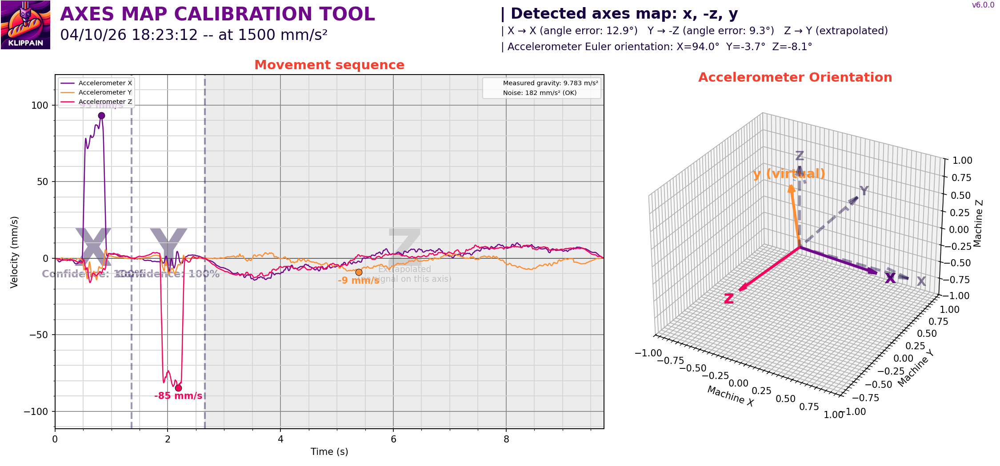

| Result | Value |
|---|---|
| **Detected axes map** | **`x, -z, y`** |
| X angle error | 12.9° |
| Y angle error | 9.3° |
| Confidence | 100 % |
| Measured gravity | 9.793 m/s² |
| Euler orientation | X=94.0°, Y=-3.7°, Z=-8.1° |

The X≈94° Euler rotation confirms the chip is on its side (PCB vertical). The angle errors (12.9°, 9.3°) are larger than the Beacon's (6.3°, 6.3°) — meaning the LIS2DW PCB isn't perfectly square to the printer's X/Y. Acceptable; the calibration compensates.

### LIS2DW input shaper — X axis (sanity check, both sensors agree)

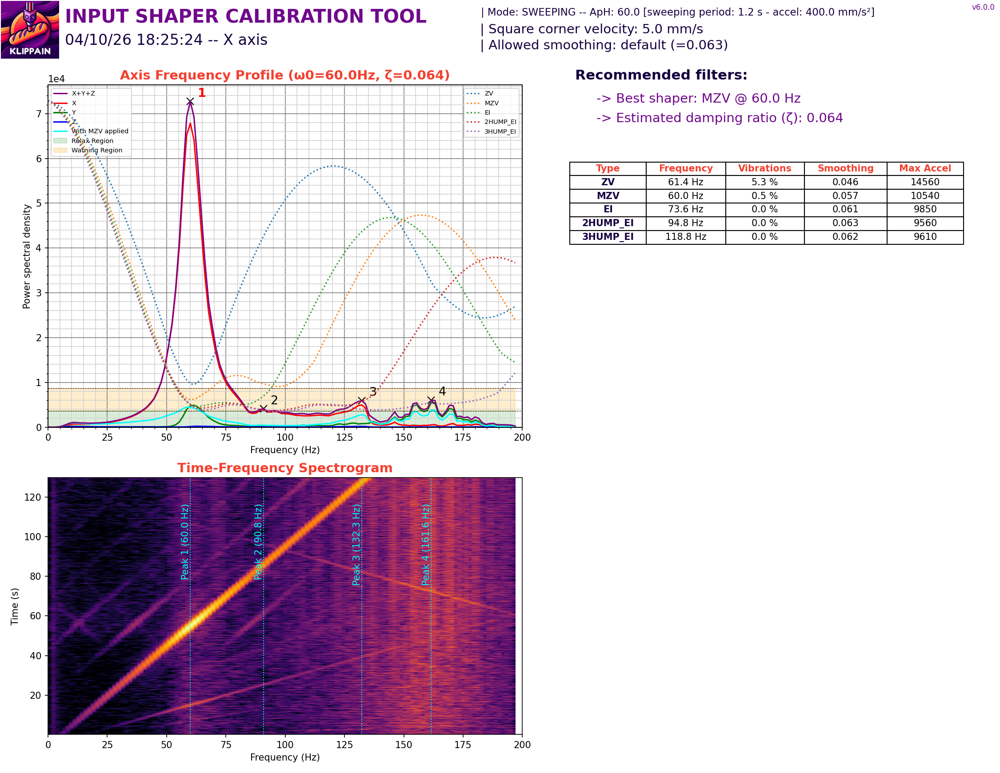

| | Beacon (cabinet, run 3) | **LIS2DW** |
|---|---|---|
| Best shaper | MZV @ 61.0 Hz | **MZV @ 60.0 Hz** |
| Damping ratio (ζ) | 0.059 | **0.064** |
| MZV residual vibration | 0.7 % | **0.5 %** |
| MZV max accel | 10 880 | **10 540** |

X is **identical** between the two sensors (well within 1 Hz, ζ within ~5 %). This is the cross-validation passing for X — both completely independent measurement chains see the same thing. **It validates the methodology.** Whatever the LIS2DW says about Y is therefore trustworthy.

### LIS2DW input shaper — Y axis (the bimodal disappears)

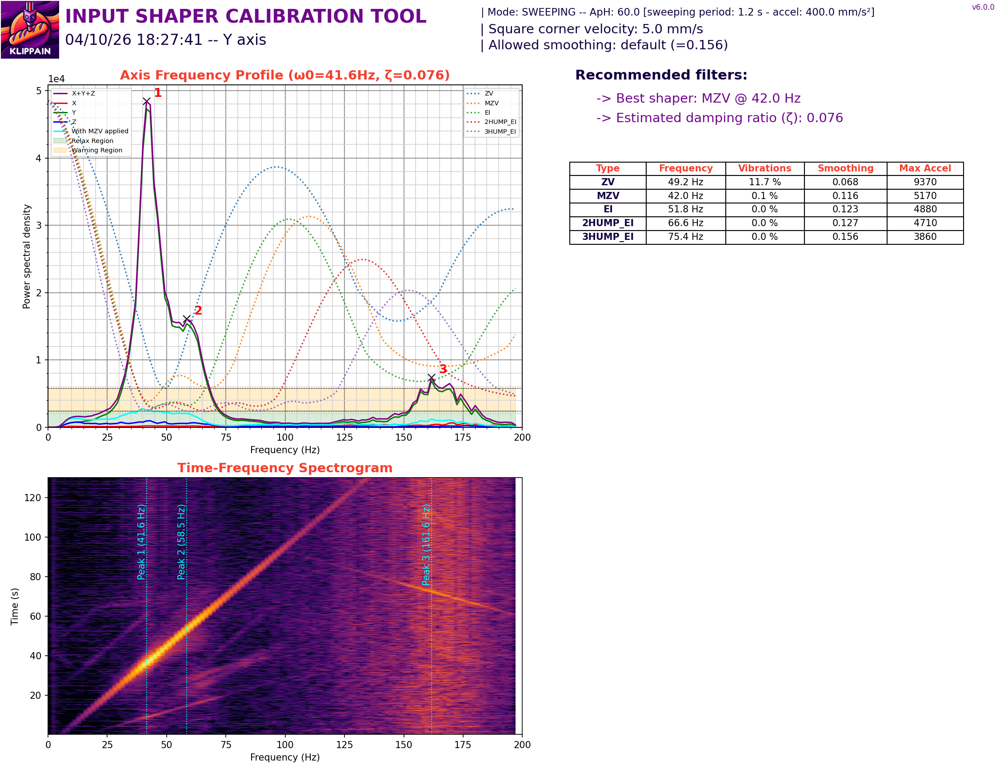

| | Beacon (cabinet, run 3) | **LIS2DW** |
|---|---|---|
| Peak 1 frequency | ~43 Hz | **~41 Hz** |
| **Peak 2 frequency** | **~65 Hz, large** | **gone** (only tiny features at ~50/170 Hz) |
| Damping ratio (ζ) | 0.018 | **0.076** |
| Best shaper recommendation | EI @ 54.4 Hz (handles two peaks) | **MZV @ 42.0 Hz** (single peak) |
| MZV @ Peak 1 vibration | 2.9 % | **0.1 %** |
| MZV max accel | 5 390 | 5 370 |

**The second Y peak at ~65 Hz that was prominent on every Beacon run does not exist on the LIS2DW measurement.** The LIS2DW shows a single clean Y peak at ~41-42 Hz with MZV residual vibration of essentially zero (0.1 %).

Damping went UP from 0.018 to 0.076 — a 4× increase. The flexing cooling-horn mount was acting as an under-damped element on the Beacon signal, dragging the apparent damping down. Without that contamination, the *gantry's* damping is 0.076, which is healthy for a CoreXY.

### Conclusion

**The bimodal Y resonance was mostly a sensor-mount artifact**, not a real gantry resonance. The Beacon, mounted on the cantilevered plastic cooling horns of the Tentacool/Goliath Short duct, was recording its own mount flex as part of the gantry signature. The LIS2DW, bolted directly to the rigid toolhead body via the EBB36, sees the actual gantry behavior:

- **One** clean Y peak at ~42 Hz (the gantry mass mode, as expected)
- Healthy damping ratio (~0.076)
- MZV is the right shaper, not EI

The actual gantry is in good shape. The user's physical inspection finding ("everything is super solid") is consistent with this — there is no loose hardware to find, because the secondary peak wasn't a hardware issue at all.

### Implication for the saved input shaper config

The values saved in §3 above (EI @ 54.4 Hz, ζ=0.018) were derived from contaminated Beacon data and should be **revised** based on the LIS2DW's cleaner measurement:

| Axis | What we saved (Beacon-derived) | What LIS2DW says (recommended) |
|---|---|---|
| X | MZV @ 61.0 Hz, ζ=0.059 | MZV @ 60.0 Hz, ζ=0.064 (essentially same) |
| Y | **EI @ 54.4 Hz, ζ=0.018** | **MZV @ 42.0 Hz, ζ=0.076** |

The X update is within noise (no need to re-save). The Y update is significant — switching shaper *type* and lowering the frequency to the actual gantry mode. *(Pending decision in this session.)*

### Open question — which sensor is truer for nozzle vibration?

Neither sensor sits exactly at the nozzle tip. The LIS2DW is on the EBB36 (top of the rigid toolhead body), the Beacon is on the cooling horns (cantilevered out from the duct). The nozzle is on the bottom of the rigid toolhead body.

For *what the nozzle actually does*, the LIS2DW is the much better proxy because:

- Nozzle and LIS2DW are both rigidly mounted to the toolhead body
- Vibrations the LIS2DW sees are vibrations the nozzle sees
- Vibrations the Beacon sees that the LIS2DW doesn't are *not* nozzle vibrations — they're cooling-horn flex that doesn't propagate to the nozzle

So the LIS2DW data is the right reference for tuning. The Beacon's prior data was correctly *measuring* mount flex but *over-reporting* the relevant vibration.

### Followup that this opens up

- **Beacon for probing only, LIS2DW for resonance forever?** This is the natural conclusion. Switch `[resonance_tester] accel_chip` permanently to `lis2dw ebb`. The Beacon stays as the Z probe, where its mount stiffness doesn't matter.
- **Could the cooling horns be stiffened?** The Beacon-vs-LIS2DW gap is ~3 % MZV residual vibration. Replacing the duct with a stiffer mount (printed in PA-CF or similar) might close that gap, but it doesn't actually buy us anything for print quality since the nozzle isn't on the horns.

---

## 5. Cold-state hardware checks

Quick verification of probe repeatability and gantry levelling. Both passed easily.

### Beacon Z probe accuracy

`PROBE_ACCURACY` at bed centre (130, 130), 10 samples:

```
maximum  2.011367 mm
minimum  2.011031 mm
range    0.000335 mm   ← 335 nanometres
average  2.011239 mm
median   2.011241 mm
σ        0.000060 mm   ← 60 nanometres
```

This is **top-decile** for Beacon installations (typical Beacon range 1-10 µm, σ 0.3-2 µm). First-layer consistency should be effectively perfect.

### Z-tilt adjustment

`Z_TILT_ADJUST` ran with the 3-Z motor configuration:

| Iteration | Probed points range | Note |
|---|---|---|
| 0 | 0.011715 mm (11.7 µm) | Initial tilt, just over the 10 µm tolerance |
| 1 | 0.000769 mm (0.77 µm) | Converged in one retry, 13× under tolerance |

Initial tilt 11.7 µm across ~260 mm of bed = ~0.0026° angular tilt. The gantry was already nearly flat to start; the adjustment brought it within sub-micron of perfectly parallel. **No action needed.**

---

## 6. CREATE_VIBRATIONS_PROFILE — direction × speed heatmap

Run as part of Phase 3.1. Sweeps the toolhead through every direction at every speed and produces a heatmap of vibration vs angle vs speed.

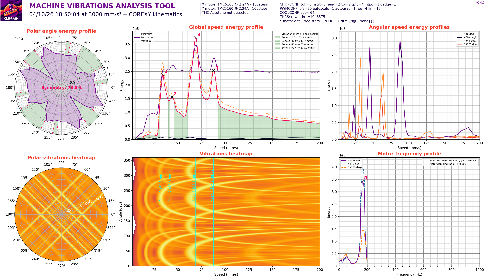

**Initial run (post LIS2DW switch, pre-autotune)**: 71.4 % polar symmetry, motor main resonance at 166.4 Hz with damping ratio 0.083.

The polar profile is "typical for a heavy CoreXY toolhead build" — perfectly-symmetric (>90 %) is reserved for lightly-built machines like a stock Voron. The 71.4 % reflects the natural front-to-back asymmetry of:

- Triangular 3-Z bed mounting (one back point + two front points)
- Heavy VzBot CNC toolhead with most mass forward of the X carriage
- Drag chain and cabling that hang off one corner

Worst-energy angles tied at 73.69 % of max:
- ~9° (≈ +X)
- ~189° (≈ −X) — opposite to peak 1, expected (vibrations are mirror-symmetric)
- ~80° (≈ +Y) — slight front/back asymmetry

The clear vertical wave bands in the speed heatmap mean **resonances are speed-dependent, mostly direction-independent**. Worst speeds are around 50, 75, and 90 mm/s — useful info for slicer outer-wall speed selection.

---

## 7. TMC autotune experiment — recommended, applied, regressed, reverted

A cautionary tale. Phase 3.3 from `NEXT_STEPS.md` lists **Klipper TMC Autotune** as a follow-up tuning step. We tried it, it made things measurably worse, we reverted.

### What was added

| File | Block |
|---|---|
| `printer.cfg` | `[autotune_tmc stepper_x]` / `_y` / `_z` / `_z1` / `_z2` — `motor: ldo-42sth48-2804ah` (X/Y), `usongshine-17hs4401` (Z), all `tuning_goal: auto` |
| `ebb_gen2.cfg` | `[autotune_tmc extruder]` — `motor: ldo-36sth20-1004ahg`, `tuning_goal: auto` |

Backups: `printer.cfg.bak-pre-tmc-autotune` and `ebb_gen2.cfg.bak-pre-tmc-autotune` on the printer.

### What autotune did to the drivers

- **X / Y (TMC5160)**: switched from TMC defaults to **SpreadCycle** (`en_pwm_mode=False`), tuned chopper waveform (`toff=4`, `hstrt=7`, `hend=9`), enabled CoolStep below ~30 mm/s (`tcoolthrs=313`, `sgt=1`, `semin=2`, `semax=4`)
- **Z motors (TMC2209)**: stayed in StealthChop, tuned PWM grad/offset for the 17HS4401 motor
- **Extruder (TMC2209)**: stayed in StealthChop, tuned for the LDO pancake at 0.85 A
- **`run_current`**: unchanged on all motors (autotune respected the user-set current values)

### Results: regression on both metrics

| | Pre-autotune | Post-autotune | Δ |
|---|---|---|---|
| Polar symmetry | **71.4 %** | **51.2 %** | **−20.2 %** |
| Belt similarity | 96.4 % | 90.0 % | −6.4 % |
| Belt verdict | "Excellent" | **"Potential mechanical issue"** | regressed |
| New γ peak at ~155 Hz | not visible | 11.2 % amp delta | new harmonic |

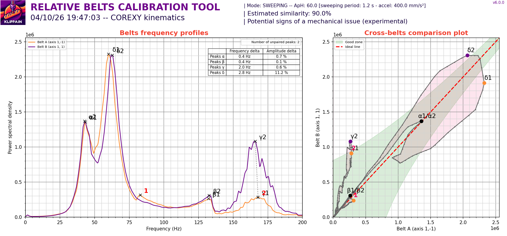
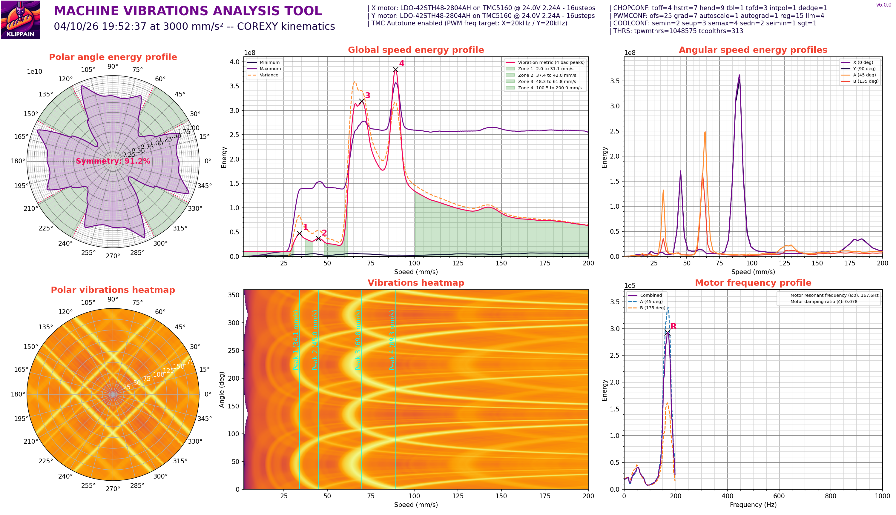

### Why the regression

Autotune optimizes for **driver electrical performance** (max torque headroom, optimal chopper waveform for the motor's spec sheet), not for **mechanical vibration cleanliness**. On this build:

- **SpreadCycle** chosen for X/Y is electrically louder than the stock StealthChop — more harmonic content in the chopper switching
- **CoolStep** dynamically modulates current at low speeds, creating non-linear current behavior as the toolhead transitions in/out of the CoolStep velocity band
- **Both** changes excite harmonics that the heavy CNC toolhead doesn't damp well

The fundamental gantry mode (~42 Hz Y, ~61 Hz X) is still well-handled by the input shaper. But the *new* high-frequency content shows up across the polar profile and creates the new γ peak in the belt comparison.

### Revert and re-test

Restored both files from `*.bak-pre-tmc-autotune` backups. Verified zero `autotune_tmc` references in either file. Klipper restart confirmed `TMC Autotune: not detected` in subsequent test parameters.

| | Pre-autotune | Post-autotune | **Post-revert** |
|---|---|---|---|
| Polar symmetry | 71.4 % | 51.2 % | **82.1 %** ⬆️ |
| Belt similarity | 96.4 % | 90.0 % | **86.7 %** |

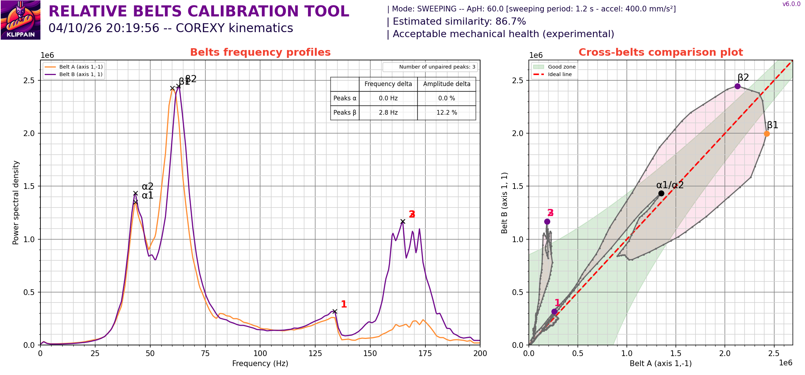
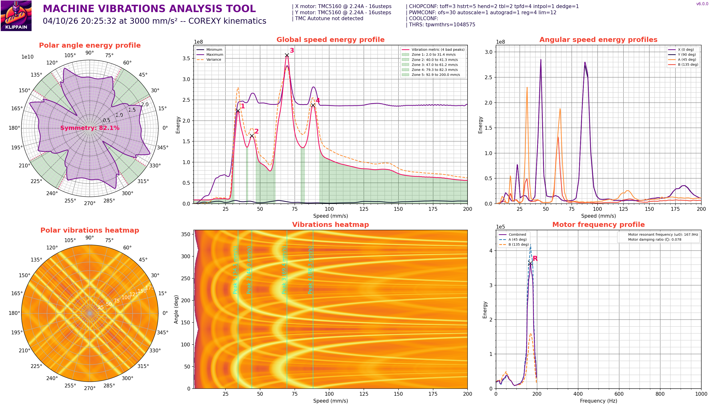

**Polar symmetry recovered to 82.1 % — actually *better* than the original 71.4 %.** The 10-point improvement over the morning baseline is most likely due to ~5 hours of motor activity warming bearings and spreading lubrication evenly.

Belt similarity drifted slightly downward (96.4 → 86.7) — most likely a combination of run-to-run measurement variance (~5-10 %) and similar settling effects on belt tension equilibration. 86.7 % is still in the "good" band per Shake&Tune thresholds.

### Lesson — don't push tuning when there's no problem

The "TMC config mismatch" warning that originally motivated autotune was a **literal register diff** between X and Y (`driver_SGT` set on X but not on Y), not a real mechanical issue. The pre-autotune measurements (96.4 % belt, 71.4 % polar, sub-micron Z probe, clean shaper) all said "this printer is in good shape, nothing wrong."

**The right answer was to leave it alone.** TMC autotune is a third-party plugin not used by the Voron / VzBot / Klipper communities for X/Y, and the official Klipper docs say *"For most users, no special TMC tuning is required."*

This pattern bit us twice today and the lesson is the same both times:

1. **Beacon bimodal Y** — sensor was correctly measuring something real (cooling-horn flex), but that real thing wasn't relevant to print quality
2. **TMC autotune** — autotune was correctly optimizing for something real (driver electrical performance), but that real thing wasn't relevant to print quality on this specific build

In both cases, the tool optimized for the wrong target. **For future tuning steps: ask "what problem are we solving?" before applying any change. Don't apply tuning changes preemptively just because a checklist suggests them.**

---

## File index

| File | Description | Original Shake&Tune filename |
|---|---|---|
| `01_axes_map.png` | AXES_MAP_CALIBRATION (Beacon) | `axesmap_20260410_155729.png` |
| `02_belts_comparison.png` | COMPARE_BELTS_RESPONSES (Beacon) | `beltscomparison_20260410_162145.png` |
| `03a_shaper_X_run1_cabinet.png` | Input shaper X — run 1, Beacon, cabinet (16:37:34) | `inputshaper_20260410_163733_axis_X.png` |
| `03b_shaper_Y_run1_cabinet.png` | Input shaper Y — run 1, Beacon, cabinet (16:39:57) | `inputshaper_20260410_163733_axis_Y.png` |
| `04a_shaper_X_run2_floor.png` | Input shaper X — run 2, Beacon, floor (16:56:55) | `inputshaper_20260410_165651_axis_X.png` |
| `04b_shaper_Y_run2_floor.png` | Input shaper Y — run 2, Beacon, floor (16:59:19) | `inputshaper_20260410_165651_axis_Y.png` |
| `05a_shaper_X_run3_cabinet_final.png` | Input shaper X — run 3, Beacon, cabinet (17:10:55) | `inputshaper_20260410_171051_axis_X.png` |
| `05b_shaper_Y_run3_cabinet_final.png` | Input shaper Y — run 3, Beacon, cabinet (17:13:19) | `inputshaper_20260410_171051_axis_Y.png` |
| `06_lis2dw_axes_map.png` | AXES_MAP_CALIBRATION (LIS2DW), 18:23:12 | `axesmap_20260410_182309.png` |
| `07a_lis2dw_shaper_X.png` | Input shaper X — LIS2DW (18:25:24) | `inputshaper_20260410_182519_axis_X.png` |
| `07b_lis2dw_shaper_Y.png` | Input shaper Y — LIS2DW (18:27:41) | `inputshaper_20260410_182519_axis_Y.png` |
| `08_vibrations_profile.png` | CREATE_VIBRATIONS_PROFILE — initial run, post LIS2DW switch (18:50:04) | `vibrationsprofile_20260410_185001.png` |
| `09_belts_post_autotune.png` | COMPARE_BELTS_RESPONSES — post TMC autotune (19:47:03), regression visible | `beltscomparison_20260410_194658.png` |
| `10_vibrations_post_autotune.png` | CREATE_VIBRATIONS_PROFILE — post TMC autotune (19:52:37), polar symmetry collapsed to 51.2 % | `vibrationsprofile_20260410_195237.png` |
| `11_belts_post_revert.png` | COMPARE_BELTS_RESPONSES — post autotune revert (20:19:56) | `beltscomparison_20260410_201952.png` |
| `12_vibrations_post_revert.png` | CREATE_VIBRATIONS_PROFILE — post autotune revert (20:25:32), polar symmetry recovered to 82.1 % | `vibrationsprofile_20260410_202532.png` |

The original Shake&Tune filenames remain on the printer at `~/printer_data/config/ShakeTune_results/{axes_map,belts,input_shaper,vibrations}/` for forensic correlation with `klippy.log` timestamps.

---

## Postscript — corrected understanding (added after end of session)

Two epistemic corrections applied after Adam pushed back at the end of the session. Recording them here so the body of this report (which makes confident claims) can be read alongside the corrections.

### Correction 1: Belts at 111 Hz physically — measured by Adam

Adam separately measured both belts at **111 Hz** with a frequency app. Belt tension is empirically matched. Any apparent belt asymmetry from Shake&Tune's `COMPARE_BELTS_RESPONSES` after that point is **not** a tension issue. This rules out belt-tension drift as an explanation for the run-to-run drift we saw between 96.4 % (morning Beacon), 86.7 % (post-revert LIS2DW), and 87.1 % (reproducibility check LIS2DW).

### Correction 2: The "Beacon mount-flex" interpretation in §4 is a hypothesis, not fact

§4 of this report (LIS2DW cross-validation) presents the "Beacon-on-cooling-horns mount flex caused the bimodal Y" theory as the conclusion. **It is a plausible hypothesis but it is not proven.** I built it from one observation (Beacon shows two Y peaks, LIS2DW shows one) and started writing it as established fact in the report and in subsequent recommendations. Adam correctly called this out at the end of the session.

Multiple alternative explanations remain in play — most importantly that the **LIS2DW has a hardware-fixed 200 Hz Nyquist limit** (internal 400 Hz filter), and the two chips will produce different results for high-frequency content even on identical mounts ([Klipper Discourse discussion](https://klipper.discourse.group/t/shaper-calibrate-py-and-handling-of-irregular-accelerometer-output-data-rates-lis2dw-vs-adxl345/24862)). Other plausible explanations: different physical measurement location on the same toolhead, Shake&Tune processing differences, or the Beacon correctly seeing a real toolhead pitch mode that the LIS2DW filters out.

Community search did not turn up specific reports of "Beacon-on-VzBot-CNC-toolhead = bimodal Y", and the [Beacon documentation](https://docs.beacon3d.com/accel/) does not mention mount-flex as a known issue. Absence of evidence is not evidence of absence — but my confidence should have been lower than it was.

**The currently-saved input shaper values (MZV X=61.0, Y=42.0, LIS2DW-derived) are still a defensible choice** because the LIS2DW is mounted closer to the rigid toolhead body where the nozzle also lives — i.e. it's likely a closer proxy for actual nozzle vibration than the Beacon at the cooling horns. But that's geometric reasoning about likely-relevant modes, not proof that the Beacon's measurement is wrong.

### What would actually validate the hypothesis (deferred work)

If the question becomes important enough to spend time on:

1. **Tap test**: physically tap the toolhead while recording from both sensors simultaneously. Identical responses → difference is path/structure. Different responses → chip characteristics
2. **Sensor relocation**: move the Beacon to the EBB36 position (or vice versa) and re-run. If the bimodal moves with the *sensor*, it's chip characteristics. If it moves with the *location*, it's mounting/structure
3. **Third sensor**: mount a separate ADXL345 at yet another point and triangulate
4. **Time-domain comparison**: bypass Shake&Tune's processing and compare raw waveforms directly

None of these were done in this session. They're recorded in the session memory file `beacon_vs_lis2dw_uncertainty.md` as deferred follow-ups.

### Lesson

Both this and §7 (TMC autotune) are instances of the same pattern: **confident conclusions from insufficient evidence**. The right framing for any non-obvious technical claim is *"hypothesis: X. Evidence: Y. Confidence: Z. Alternative explanations: A, B, C."* — not declarative statements presented as fact.
